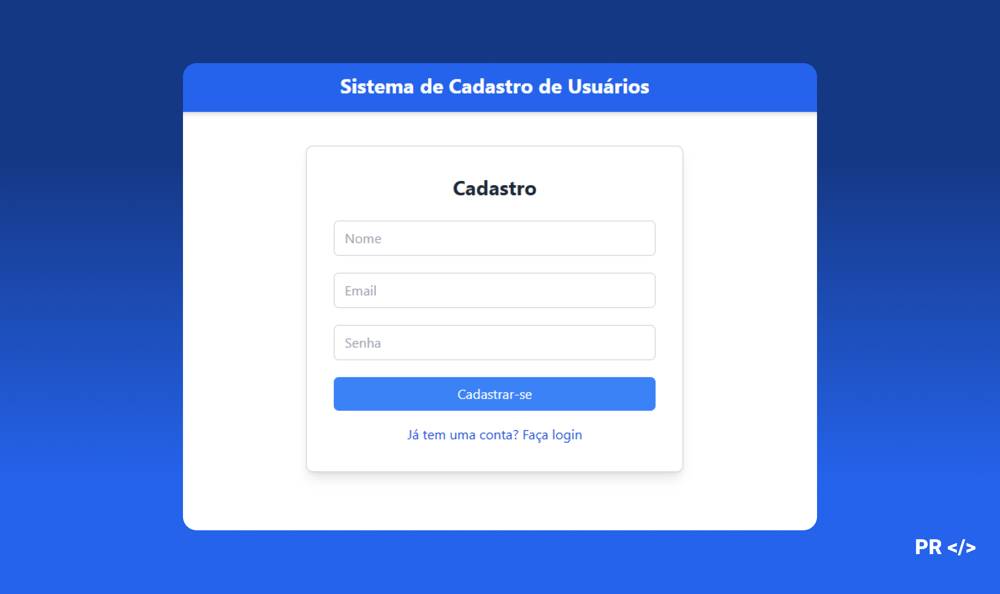

# Sistema de Cadastro de Usuários | Front-end

Este projeto é uma aplicação front-end para o cadastro de usuários, com autenticação e área privada acessível apenas por usuários autenticados. A interface foi construída com **React** e **Tailwind CSS**, e utiliza **Axios** para se comunicar com a API.

## Tecnologias Utilizadas

- **React**: Biblioteca para construção de interfaces de usuário dinâmicas.
- **Tailwind CSS**: Framework de estilos para criação de layouts responsivos.
- **Axios**: Cliente HTTP para consumo da API.
- **JWT (JSON Web Tokens)**: Para autenticação e proteção de rotas.
- **React Router**: Para navegação entre as páginas da aplicação.

## Funcionalidades

### Front-end

- **Página de Cadastro**: Interface que permite ao usuário registrar um novo cadastro.
- **Página de Login**: Formulário de login para autenticação de usuários existentes.
- **Área Privada (Listagem)**: Página acessível apenas para usuários autenticados, onde é possível visualizar dados após login.
- **Gerenciamento de Sessão**: Utiliza JWT para manter a sessão do usuário autenticada durante a navegação na aplicação.

## Instalação e Uso

### Pré-requisitos

- Node.js e npm instalados

### Instruções de Instalação

1. Clone o repositório:

```bash
git clone https://github.com/your-username/repository-name.git
```
## 📄 Licença

- MIT License
- Este projeto é de uso livre e pode ser modificado ou integrado em outros projetos.